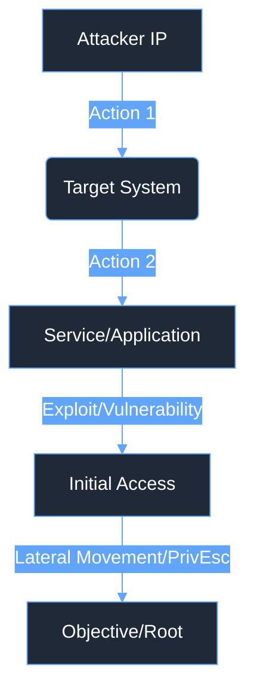

# 🧪 Lab Writeup: [Challenge/Lab Name] ([Difficulty])

<div align="center">
  
  
  
  
</div>

## 🎯 The Mission
[Briefly describe the one-sentence objective of the lab/challenge. e.g., Simulate a realistic attack workflow demonstrating X to evaluate SOC detection capabilities.]

---

## 🗺️ Attack Topology



---

## 📊 Executive Summary

| Phase | Description | Key Focus |
| :--- | :--- | :--- |
| **Initial Access** | [High-level summary of initial compromise] | [Defensive focus, e.g., Detecting anomalous file uploads] |
| **Execution** | [High-level summary of commands run] | [Defensive focus] |
| **Privilege Escalation** | [High-level summary of privilege escalation] | [Defensive focus] |
| **[Other Phase]** | [High-level summary] | [Defensive focus] |

---

## ⏱️ Incident Timeline (Simulated)
*   **[HH:MM:SS] UTC:** [Event 1, e.g., Nmap scan initiated]
*   **[HH:MM:SS] UTC:** [Event 2, e.g., Payload uploaded]
*   **[HH:MM:SS] UTC:** [Event 3, e.g., Reverse shell established]
*   **[HH:MM:SS] UTC:** [Event 4, e.g., Privilege escalation achieved]

---

## 🔍 The Investigation

### 1. Alert Triage & Initial Access Analysis
*   **Analyst Action:** [Describe the action taken by the analyst to investigate the initial access vector.]
*   **Observation:** [Describe the findings, e.g., The attacker utilized X vulnerability to achieve Y.]

<details>
  <summary>Click to view: Simulated/Raw Log - [Log Description]</summary>

  ```
  [Insert raw log snippet, command output, or relevant evidence here]
  ```
</details>

### 2. Execution & Persistence Verification
*   **Analyst Action:** [Describe the action taken to identify post-exploitation activities.]
*   **Observation:** [Describe the findings, e.g., The attacker spawned an interactive shell using X.]

<details>
  <summary>Click to view: Simulated/Raw Log - [Log Description]</summary>

  ```
  [Insert raw log snippet, command output, or relevant evidence here]
  ```
</details>

### 3. Privilege Escalation (If Applicable)
*   **Analyst Action:** [Describe the action taken to trace the escalation path.]
*   **Observation:** [Describe the findings, e.g., The attacker exploited X to gain root access.]

<details>
  <summary>Click to view: Simulated/Raw Log - [Log Description]</summary>

  ```
  [Insert raw log snippet, command output, or relevant evidence here]
  ```
</details>

---

## 🎯 MITRE ATT&CK Mapping

| Tactic | Technique | ID | Description |
| :--- | :--- | :--- | :--- |
| **[Tactic Name]** | [Technique Name] | [TXXXX] | [Brief description of how it applies to this lab] |
| **[Tactic Name]** | [Technique Name] | [TXXXX.XXX] | [Brief description of how it applies to this lab] |

---

## 🛑 Closing: Remediation & Lessons Learned

### Containment & Eradication Strategy
*   **Remediation Strategy:** [Recommendation 1, e.g., Patch the specific vulnerability.]
*   **Remediation Strategy:** [Recommendation 2, e.g., Implement strict input validation.]

### Post-Incident Activity (Detection Opportunities)
*   **Analyst Action:** [Detection engineering idea 1, e.g., Develop a Splunk alert monitoring for X.]
*   **Analyst Action:** [Detection engineering idea 2, e.g., Create a Sigma rule targeting Y.]
