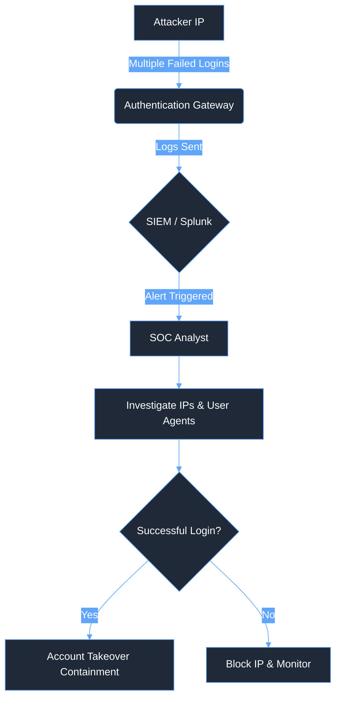

# 🛡️ Brute Force / Credential Stuffing Playbook

<div align="center">
  
  
  
</div>

## 🎯 The Mission
Rapidly detect, investigate, and contain anomalous authentication attempts targeting enterprise infrastructure to prevent unauthorized access and credential compromise.

---

## 🗺️ Attack Topology



---

## 📊 Executive Summary

| Phase | Description | Key Focus |
| :--- | :--- | :--- |
| **Preparation** | Ensure access to SIEM (Splunk), IAM platforms (AD/Azure), and perimeter controls (pfSense). | Centralized visibility and access control. |
| **Detection** | Alert triggered by high volume of failed logins or a single success post-failure stream. | Identifying targeted accounts and source IPs. |
| **Containment** | Temporarily lock accounts, implement IP blocks, revoke active sessions. | Stopping unauthorized access immediately. |
| **Eradication** | Force password resets, enforce MFA, and review post-login activity. | Restoring secure state. |

---

## ⏱️ Incident Timeline (Example Scenario)
*   **08:15:00 UTC:** Alert triggered in Splunk: "High Volume Failed Logins from Single IP".
*   **08:17:30 UTC:** Analyst begins investigation, identifying Source IP: `198.51.100.45` targeting service: O365.
*   **08:22:15 UTC:** Analyst discovers a successful login (Event ID 4624) for user `jdoe` immediately following 50 failures.
*   **08:25:00 UTC:** Analyst initiates immediate containment: `jdoe` account locked, active sessions revoked.
*   **08:28:45 UTC:** IP `198.51.100.45` blocked at the perimeter firewall (pfSense).

---

## 🔍 The Investigation

### 1. Alert Triage & Contextualization
*   **Analyst Action:** Query Splunk for the specific timeframe surrounding the alert trigger, focusing on Windows Event ID 4625 (Failed Logon).
*   **Observation:** Note the Source IP Address(es), targeted Username(s), and the specific User-Agent strings.

<details>
  <summary>Click to view: Splunk Query - Failed Logon Aggregation</summary>

  ```spl
  index=windows sourcetype=WinEventLog:Security EventCode=4625
  | stats count by src_ip, user, action
  | where count > 10
  | sort - count
  ```
</details>

<details>
  <summary>Click to view: Raw Windows Event Log (4625 - Failed Logon)</summary>

  ```xml
  <Event xmlns="http://schemas.microsoft.com/win/2004/08/events/event">
    <System>
      <Provider Name="Microsoft-Windows-Security-Auditing" Guid="{54849625-5478-4994-A5BA-3E3B0328C30D}" />
      <EventID>4625</EventID>
      <Version>0</Version>
      <Level>0</Level>
      <Task>12544</Task>
      <Opcode>0</Opcode>
      <Keywords>0x8020000000000000</Keywords>
      <TimeCreated SystemTime="2024-05-24T08:16:32.000000000Z" />
      <EventRecordID>123456</EventRecordID>
      <Correlation />
      <Execution ProcessID="500" ThreadID="1200" />
      <Channel>Security</Channel>
      <Computer>DC01.enterprise.local</Computer>
      <Security />
    </System>
    <EventData>
      <Data Name="SubjectUserSid">S-1-0-0</Data>
      <Data Name="SubjectUserName">-</Data>
      <Data Name="SubjectDomainName">-</Data>
      <Data Name="SubjectLogonId">0x0</Data>
      <Data Name="TargetUserSid">S-1-0-0</Data>
      <Data Name="TargetUserName">jdoe</Data>
      <Data Name="TargetDomainName">ENTERPRISE</Data>
      <Data Name="Status">0xc000006d</Data>
      <Data Name="FailureReason">%%2313</Data>
      <Data Name="SubStatus">0xc000006a</Data>
      <Data Name="LogonType">3</Data>
      <Data Name="LogonProcessName">NtLmSsp </Data>
      <Data Name="AuthenticationPackageName">NTLM</Data>
      <Data Name="WorkstationName">-</Data>
      <Data Name="TransmittedServices">-</Data>
      <Data Name="LmPackageName">-</Data>
      <Data Name="KeyLength">0</Data>
      <Data Name="ProcessId">0x0</Data>
      <Data Name="ProcessName">-</Data>
      <Data Name="IpAddress">198.51.100.45</Data>
      <Data Name="IpPort">54321</Data>
    </EventData>
  </Event>
  ```
</details>

### 2. Identifying Compromise (Successful Logons)
*   **Analyst Action:** Query for successful logons (Event ID 4624) originating from the malicious IPs identified in Step 1.
*   **Observation:** Determine if the attacker successfully bypassed authentication, indicating an account takeover (ATO).

<details>
  <summary>Click to view: Splunk Query - Successful Logon Post-Brute Force</summary>

  ```spl
  index=windows sourcetype=WinEventLog:Security EventCode=4624 src_ip="198.51.100.45"
  | table _time, user, src_ip, Logon_Type
  ```
</details>

### 3. Post-Login Activity Analysis (If Compromised)
*   **Analyst Action:** If a successful login is confirmed, aggressively trace all post-login actions associated with the compromised account session.
*   **Observation:** Review logs for unauthorized internal access, creation of persistent inbox rules (e.g., O365 forwarding to external domains), or abnormal data access patterns.

---

## 🎯 MITRE ATT&CK Mapping

| Tactic | Technique | ID | Description |
| :--- | :--- | :--- | :--- |
| **Credential Access** | Brute Force | [T1110](https://attack.mitre.org/techniques/T1110/) | Adversaries may use brute force techniques to gain access to accounts when passwords are unknown or when password hashes are obtained. |
| **Credential Access** | Password Spraying | [T1110.003](https://attack.mitre.org/techniques/T1110/003/) | Adversaries may use a single password against many accounts. |
| **Credential Access** | Credential Stuffing | [T1110.004](https://attack.mitre.org/techniques/T1110/004/) | Adversaries may use stolen credentials from one service against another. |

---

## 🛑 Closing: Remediation & Lessons Learned

### Containment Strategy
*   **Remediation Strategy:** Immediately execute account locks or force password resets for all targeted user accounts to halt unauthorized access.
*   **Remediation Strategy:** Implement emergency block rules on the pfSense firewall and WAF to drop all traffic originating from the identified malicious IPs or ASNs.
*   **Remediation Strategy:** Revoke all active authentication tokens and sessions linked to the compromised accounts via the IAM platform (e.g., Azure AD).

### Eradication & Recovery
*   **Remediation Strategy:** Guide users through secure account recovery, strictly enforcing the creation of strong, unique passwords. Ensure MFA is fully enabled and functioning on all externally facing services.
*   **Remediation Strategy:** If post-login activity analysis indicates unauthorized data access, immediately escalate to a full incident response to assess potential data exfiltration or lateral movement.

### Post-Incident Activity
*   **Analyst Action:** Refine threshold-based alerts within Splunk (e.g., dynamically adjusting the trigger from 10 failed attempts to 5 within a 2-minute window from a single IP based on observed attacker tempo).
*   **Analyst Action:** Develop and deploy custom **Sigma rules** to enhance the detection of distributed credential stuffing campaigns by focusing on behavioral patterns rather than static IOCs.
*   **Remediation Strategy:** Propose the implementation or tightening of rate-limiting policies and geographic restrictions (geo-blocking) on all external authentication portals.
