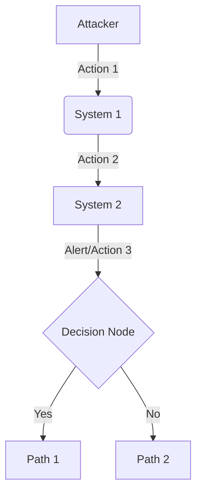

# 🎣 [Playbook Name] Playbook

<div align="center">
  
  
  
</div>

## 🎯 The Mission
[One-sentence objective of the playbook]

---

## 🗺️ Attack Topology



---

## 📊 Executive Summary

| Phase | Description | Key Focus |
| :--- | :--- | :--- |
| **Preparation** | [Prerequisites for handling the alert] | [Key Focus Area] |
| **Detection** | [Initial alert details and trigger] | [Key Focus Area] |
| **Containment** | [Immediate actions for isolation] | [Key Focus Area] |
| **Eradication** | [Procedures for removing the threat] | [Key Focus Area] |

---

## ⏱️ Incident Timeline (Example Scenario)
*   **[HH:MM:SS] UTC:** [Event 1]
*   **[HH:MM:SS] UTC:** [Event 2]
*   **[HH:MM:SS] UTC:** [Event 3]
*   **[HH:MM:SS] UTC:** [Event 4]
*   **[HH:MM:SS] UTC:** [Event 5]

---

## 🔍 The Investigation

### 1. [Investigation Step 1]
*   **Analyst Action:** [Describe the action taken by the analyst]
*   **Observation:** [Describe the expected observation or finding]

<details>
  <summary>Click to view: [Log/Evidence Description]</summary>

  ```
  [Raw log, command output, or relevant evidence]
  ```
</details>

### 2. [Investigation Step 2]
*   **Analyst Action:** [Describe the action taken by the analyst]
*   **Observation:** [Describe the expected observation or finding]

<details>
  <summary>Click to view: [Log/Evidence Description]</summary>

  ```
  [Raw log, command output, or relevant evidence]
  ```
</details>

---

## 🎯 MITRE ATT&CK Mapping

| Tactic | Technique | ID | Description |
| :--- | :--- | :--- | :--- |
| **[Tactic Name]** | [Technique Name] | [TXXXX] | [Description] |
| **[Tactic Name]** | [Technique Name] | [TXXXX.XXX] | [Description] |

---

## 🛑 Closing: Remediation & Lessons Learned

### Containment Strategy
*   **Remediation Strategy:** [Containment action 1]
*   **Remediation Strategy:** [Containment action 2]

### Eradication & Recovery
*   **Remediation Strategy:** [Eradication action 1]
*   **Remediation Strategy:** [Recovery action 2]

### Post-Incident Activity
*   **Analyst Action:** [Post-incident action 1, e.g., create new alert]
*   **Analyst Action:** [Post-incident action 2, e.g., tune existing rule]
