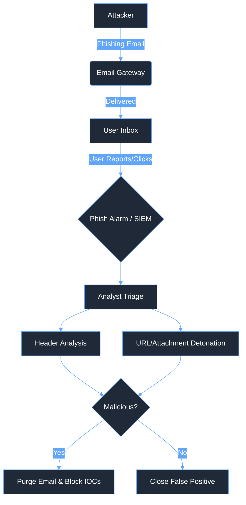

# 🎣 Phishing Analysis Playbook

<div align="center">
  
  
  
</div>

## 🎯 The Mission
Rapidly analyze suspicious emails, detonate payloads securely, and neutralize malicious infrastructure to prevent credential harvesting or malware execution.

---

## 🗺️ Attack Topology



---

## 📊 Executive Summary

| Phase | Description | Key Focus |
| :--- | :--- | :--- |
| **Preparation** | Access to email security gateways, SIEM, and sandbox environments (Any.Run). | Tool readiness for URL/Attachment analysis. |
| **Detection** | Alert from email gateway or user-reported phishing attempt. | Initial triage and information gathering. |
| **Containment** | Purge malicious emails from inboxes, block sender domains/IPs. | Stopping the spread and preventing interaction. |
| **Eradication** | Isolate compromised hosts, force password resets, initiate EDR scans. | Removing the threat and securing access. |

---

## ⏱️ Incident Timeline (Example Scenario)
*   **10:00:00 UTC:** Alert triggered via user reporting a suspicious email (Subject: "Urgent Invoice Attached").
*   **10:05:30 UTC:** Analyst begins investigation, extracting headers and attachment hash.
*   **10:12:15 UTC:** Analyst detonates attachment in Any.Run, observing malicious payload dropping (e.g., Emotet/Qakbot).
*   **10:15:00 UTC:** Analyst initiates containment: email purged from all inboxes, sender domain blocked at the gateway.
*   **10:20:45 UTC:** Analyst verifies no other users interacted with the email; incident closed.

---

## 🔍 The Investigation

### 1. Initial Triage & Contextualization
*   **Analyst Action:** Identify the reported email and extract critical metadata: Sender Address, Recipient(s), Subject, Date/Time, Message ID.
*   **Observation:** Determine the immediate scope of the campaign (targeted vs. broad spray).

<details>
  <summary>Click to view: Initial Extracted Metadata</summary>

  ```
  Sender: invoice@billing-update-secure.com
  Recipient: finance@enterprise.local
  Subject: Urgent: Unpaid Invoice #78492
  Date: 2024-05-24 09:55:00 UTC
  Message-ID: <12345678.90abcdef@billing-update-secure.com>
  Attachment: Invoice_78492.pdf.exe
  ```
</details>

### 2. Header Analysis
*   **Analyst Action:** Analyze the `Received` headers to trace the email's origin path and verify authentication protocols (SPF, DKIM, DMARC).
*   **Observation:** Check if the email bypassed authentication mechanisms or utilized domain spoofing techniques. Note discrepancies between the `Reply-To` and `From` addresses.

<details>
  <summary>Click to view: Raw Email Headers (Analysis)</summary>

  ```
  Received: from mail.billing-update-secure.com (198.51.100.22)
    by mx.enterprise.local with ESMTP id 12345;
    Fri, 24 May 2024 09:55:10 +0000
  Received-SPF: Pass (domain of billing-update-secure.com designates 198.51.100.22 as permitted sender)
  Authentication-Results: mx.enterprise.local; dkim=none (message not signed)
  From: "Billing Dept" <invoice@billing-update-secure.com>
  Reply-To: attacker@protonmail.com
  Subject: Urgent: Unpaid Invoice #78492
  ```
</details>

### 3. URL/Attachment Detonation
*   **Analyst Action:** Extract all URLs (defang them using CyberChef) and attachment hashes (MD5, SHA256).
*   **Analyst Action:** Analyze link destinations and attachment behavior in a secure sandbox (e.g., Any.Run, Joe Sandbox) or using reputation services (VirusTotal, URLhaus).
*   **Observation:** Document dropped payloads, command execution, or network connections initiated by the attachment or URL.

<details>
  <summary>Click to view: Sandbox Analysis Results (Attachment)</summary>

  ```
  File: Invoice_78492.pdf.exe
  SHA256: e3b0c44298fc1c149afbf4c8996fb92427ae41e4649b934ca495991b7852b855
  Detection: Malicious (Trojan.Downloader)
  Behavior:
  - Process Creation: powershell.exe -ExecutionPolicy Bypass -WindowStyle Hidden -EncodedCommand <base64>
  - Network Connection: hxxp://malicious-c2[.]com/payload.bin
  ```
</details>

---

## 🎯 MITRE ATT&CK Mapping

| Tactic | Technique | ID | Description |
| :--- | :--- | :--- | :--- |
| **Initial Access** | Phishing | [T1566](https://attack.mitre.org/techniques/T1566/) | Adversaries may send phishing messages to gain access to victim systems. |
| **Initial Access** | Spearphishing Attachment | [T1566.001](https://attack.mitre.org/techniques/T1566/001/) | Adversaries may send spearphishing emails with a malicious attachment. |
| **Initial Access** | Spearphishing Link | [T1566.002](https://attack.mitre.org/techniques/T1566/002/) | Adversaries may send spearphishing emails with a malicious link. |

---

## 🛑 Closing: Remediation & Lessons Learned

### Containment Strategy
*   **Remediation Strategy:** Execute a compliance search across the email environment (e.g., O365) and permanently purge the malicious email from all recipient inboxes to prevent further interaction.
*   **Remediation Strategy:** Implement block rules on the email gateway for the malicious sender domain and IP address.
*   **Remediation Strategy:** Block any malicious URLs or IPs extracted during sandbox analysis on the corporate web proxy and perimeter firewalls.

### Eradication & Recovery
*   **Remediation Strategy:** If telemetry indicates a user clicked a malicious link or executed an attachment, immediately isolate the compromised host from the network.
*   **Remediation Strategy:** Force a mandatory password reset for the affected user and initiate a full, deep EDR scan on the isolated endpoint.
*   **Remediation Strategy:** Actively monitor SIEM logs for any signs of lateral movement or unauthorized access originating from the compromised host or utilizing the potentially compromised credentials.

### Post-Incident Activity
*   **Analyst Action:** Tune email gateway filtering rules based on the specific tactics observed in the campaign (e.g., blocking `.exe` files disguised as `.pdf` documents).
*   **Analyst Action:** Create and deploy SIEM alerts incorporating the newly identified IOCs (domains, IPs, file hashes) to detect any subsequent activity related to the campaign.
*   **Remediation Strategy:** Recommend targeted security awareness training for users who interacted with the phishing email to reinforce defensive posture.
