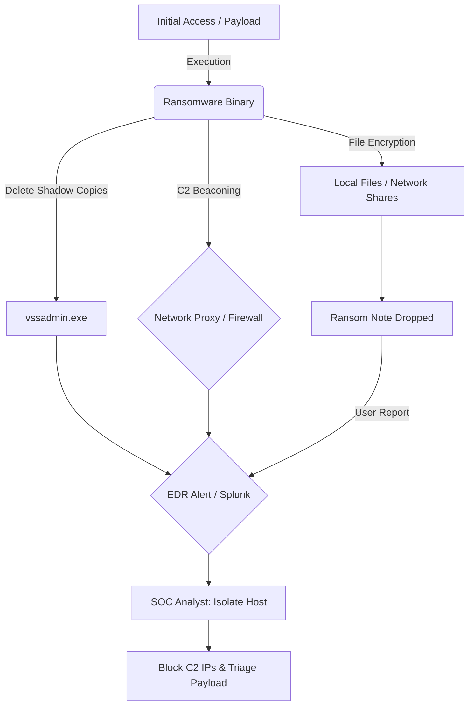

# 🛑 Ransomware Containment & Eradication Playbook

<div align="center">
  
  
  
</div>

## 🎯 The Mission
Execute immediate, aggressive containment protocols to halt the spread of ransomware encryption, preserve volatile forensic evidence, and initiate structured recovery operations.

---

## 🗺️ Attack Topology



---

## 📊 Executive Summary

| Phase | Description | Key Focus |
| :--- | :--- | :--- |
| **Preparation** | Ensure immediate access to SIEM (Splunk), EDR consoles, and perimeter firewall controls (pfSense). | Tool readiness for rapid isolation and network blocking. |
| **Detection** | Alert triggered by EDR (e.g., mass file modification, `vssadmin` usage), network spikes, or user reports of locked files. | Identifying the affected host, user, and initial alert source. |
| **Containment** | Immediate logical/physical isolation of the endpoint, disabling compromised accounts, and blocking C2 traffic. | Halting lateral movement and encryption spread. |
| **Eradication** | Full host re-imaging, restoring from immutable backups, and sweeping the environment for remaining IOCs. | Returning the environment to a secure, operational state. |

---

## ⏱️ Incident Timeline (Example Scenario)
*   **14:30:00 UTC:** Critical EDR Alert: "Suspicious Process Execution: `vssadmin.exe Delete Shadows`" on host `WKSTN-FIN-04`.
*   **14:31:15 UTC:** Analyst validates alert and observes rapid file modification events in Sysmon logs.
*   **14:32:00 UTC:** Immediate Containment: Analyst initiates network isolation for `WKSTN-FIN-04` via the EDR console.
*   **14:35:45 UTC:** Network analysis reveals beaconing to `198.51.100.88` prior to isolation. IP blocked at the perimeter (pfSense).
*   **14:40:00 UTC:** Analyst disables the AD account associated with the logged-in user to prevent lateral movement to file shares.

---

## 🔍 The Investigation

### 1. Endpoint Triage & Contextualization
*   **Analyst Action:** Query the SIEM (Splunk) for Event IDs related to process creation (Event ID 4688) or file share access (Event ID 5140) originating from the affected host to trace the execution chain and potential lateral movement.
*   **Observation:** Identify the specific ransomware family by analyzing encrypted file extensions and locating the dropped ransom note.

<details>
  <summary>Click to view: Splunk Query - Ransomware Process Execution (vssadmin)</summary>

  ```spl
  index=windows sourcetype=WinEventLog:Security EventCode=4688 Image="*\\vssadmin.exe" CommandLine="*delete shadows*"
  | table _time, Computer, SubjectUserName, NewProcessName, CommandLine
  ```
</details>

<details>
  <summary>Click to view: Raw Windows Event Log (4688 - vssadmin execution)</summary>

  ```xml
  <Event xmlns="http://schemas.microsoft.com/win/2004/08/events/event">
    <System>
      <Provider Name="Microsoft-Windows-Security-Auditing" Guid="{54849625-5478-4994-A5BA-3E3B0328C30D}" />
      <EventID>4688</EventID>
      <Version>2</Version>
      <Level>0</Level>
      <Task>12288</Task>
      <Opcode>0</Opcode>
      <Keywords>0x8020000000000000</Keywords>
      <TimeCreated SystemTime="2024-05-24T14:30:12.000000000Z" />
      <EventRecordID>987654</EventRecordID>
      <Correlation />
      <Execution ProcessID="4" ThreadID="120" />
      <Channel>Security</Channel>
      <Computer>WKSTN-FIN-04.enterprise.local</Computer>
      <Security />
    </System>
    <EventData>
      <Data Name="SubjectUserSid">S-1-5-21-1234567890</Data>
      <Data Name="SubjectUserName">admin_user</Data>
      <Data Name="SubjectDomainName">ENTERPRISE</Data>
      <Data Name="SubjectLogonId">0x12345</Data>
      <Data Name="NewProcessId">0xabc</Data>
      <Data Name="NewProcessName">C:\Windows\System32\vssadmin.exe</Data>
      <Data Name="TokenElevationType">%%1936</Data>
      <Data Name="ProcessId">0xdef</Data>
      <Data Name="CommandLine">vssadmin.exe Delete Shadows /All /Quiet</Data>
      <Data Name="ParentProcessName">C:\Users\admin_user\Downloads\invoice_update.exe</Data>
    </EventData>
  </Event>
  ```
</details>

### 2. Network Telemetry Analysis
*   **Analyst Action:** Utilize Wireshark or query the SIEM for network traffic originating from the affected subnet.
*   **Observation:** Actively hunt for beaconing behavior, data exfiltration patterns (large outbound transfers), or connections to known Tor entry nodes prior to the encryption phase.

<details>
  <summary>Click to view: Network Flow Analysis (Outbound C2)</summary>

  ```
  Source IP: 10.0.5.44 (WKSTN-FIN-04)
  Destination IP: 198.51.100.88
  Destination Port: 443
  Protocol: TCP (TLS Encrypted)
  Bytes Transferred: 1.2 GB (High outbound volume indicating potential exfiltration)
  Time: 14:15:00 UTC - 14:28:00 UTC
  ```
</details>

### 3. Payload Extraction & Static Analysis
*   **Analyst Action:** If the malicious executable or script is recovered, perform safe static analysis within a heavily isolated sandbox environment.
*   **Observation:** Utilize custom Python scripts or tools like `strings` and `peid` to safely parse, deobfuscate, and extract embedded URLs, IP addresses, or configuration data from the dumped payload.

---

## 🎯 MITRE ATT&CK Mapping

| Tactic | Technique | ID | Description |
| :--- | :--- | :--- | :--- |
| **Impact** | Data Encrypted for Impact | [T1486](https://attack.mitre.org/techniques/T1486/) | Adversaries may encrypt data on target systems to interrupt availability. |
| **Impact** | Inhibit System Recovery | [T1490](https://attack.mitre.org/techniques/T1490/) | Adversaries may delete or remove built-in data and system recovery features (e.g., volume shadow copies). |
| **Execution** | Command and Scripting Interpreter | [T1059](https://attack.mitre.org/techniques/T1059/) | Adversaries may abuse command and script interpreters to execute commands, scripts, or binaries. |

---

## 🛑 Closing: Remediation & Lessons Learned

### Containment Strategy
*   **Remediation Strategy:** Execute immediate logical isolation of the compromised endpoint via the EDR console to sever network connectivity and halt lateral spread. *Crucially, do not power off the machine* to ensure volatile memory (RAM) is preserved for deeper forensic analysis.
*   **Remediation Strategy:** Implement emergency block rules on the perimeter firewall (pfSense) to drop all outbound and inbound traffic associated with the identified Command and Control (C2) IP addresses and domains.
*   **Remediation Strategy:** Immediately disable the Active Directory account of the user logged into the compromised machine to terminate any authenticated access to internal network file shares or critical infrastructure.

### Eradication & Recovery
*   **Remediation Strategy:** Completely wipe the infected endpoint and re-image it utilizing a known good, clean OS baseline.
*   **Remediation Strategy:** Initiate data restoration procedures from offline, immutable backups. Rigorously verify the integrity and cleanliness of the backup before authorizing restoration.
*   **Remediation Strategy:** Force a mandatory global password reset for all user accounts that were active on or had administrative access to the compromised machine.
*   **Remediation Strategy:** Conduct a comprehensive EDR sweep across the entire enterprise environment utilizing the identified Indicators of Compromise (IOCs) to guarantee no secondary backdoors or dormant payloads remain.

### Post-Incident Activity
*   **Analyst Action:** Develop, test, and deploy robust **Sigma rules** based on the specific adversary techniques observed during the incident (e.g., high-fidelity alerts for `vssadmin.exe Delete Shadows` or anomalous PowerShell execution patterns) to significantly enhance SIEM detection capabilities.
*   **Remediation Strategy:** Review and rigorously tighten lateral movement defenses, prioritizing strict network segmentation (VLANs) and the aggressive restriction of local administrator privileges (LAPS).
*   **Analyst Action:** Facilitate a structured post-incident review (AAR - After Action Report) with the security team to identify critical visibility gaps, response time delays, and areas for playbook refinement.
